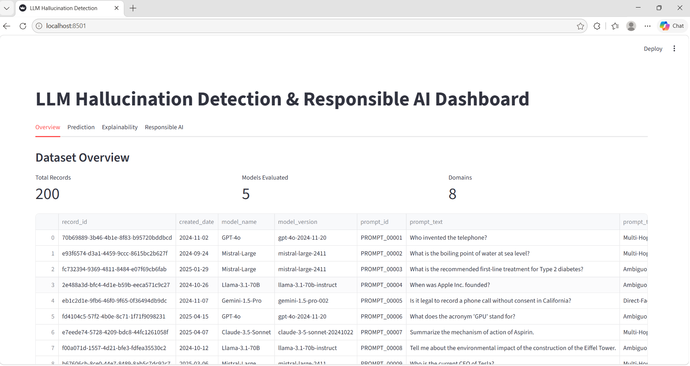
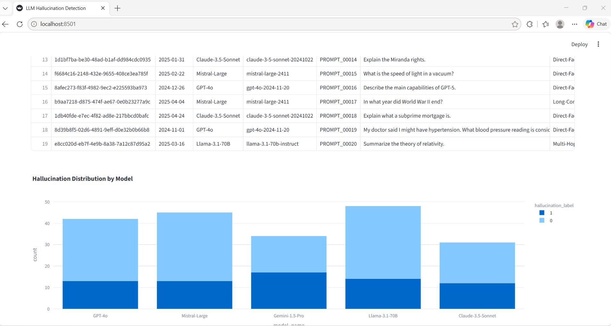
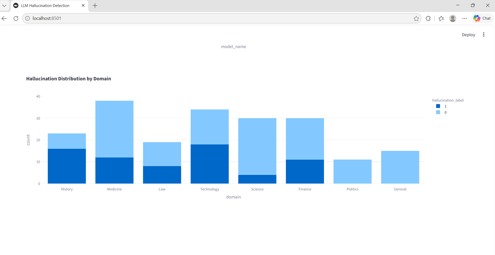

# LLM Hallucination Detection & Responsible AI Dashboard

An AI-powered hallucination detection and responsible AI analysis platform designed to evaluate the reliability, explainability, and fairness of Large Language Model (LLM) responses.

This project combines NLP pipelines, explainable AI workflows, responsible AI evaluation, interactive dashboards, FastAPI services, and containerized deployment architecture to monitor and analyze AI-generated content across multiple domains.

---

## Applications

- LLM hallucination detection
- Responsible AI validation
- AI response reliability analysis
- Explainable AI workflows
- NLP experimentation
- AI governance dashboards
- AI model monitoring
- AI evaluation systems
- AI transparency analysis
- Real-time hallucination scoring

---

## Key Highlights

- Interactive Streamlit AI dashboard
- Hallucination detection using NLP techniques
- Responsible AI fairness analysis
- SHAP and LIME explainability integration
- FastAPI REST API backend
- Real-time hallucination probability scoring
- Visualization analytics and reporting
- Dockerized deployment workflow
- Modular AI engineering architecture
- Production-style AI deployment pipeline

---

## Technologies & Tools

### AI & NLP
- Python
- Scikit-learn
- TF-IDF Vectorization
- Sentence Transformers
- NLP Classification Pipelines

### Explainable AI
- SHAP
- LIME

### Responsible AI
- Fairlearn

### Data Processing
- Pandas
- NumPy

### Backend Services
- FastAPI
- Uvicorn

### Dashboard & Visualization
- Streamlit
- Plotly
- Matplotlib

### Deployment & Infrastructure
- Docker
- Docker Compose
- Containerized AI Deployment

### Development Tools
- Git
- GitHub
- VS Code
- REST API Testing

---

# Dashboard Screenshots

## Dashboard Overview



---

## Model Analytics



---

## Responsible AI Analysis



---

## Project Architecture

```text
llm-hallucination-detection-ai/
│
├── api/
├── app/
├── data/
├── models/
├── reports/
├── screenshots/
├── src/
├── Dockerfile
├── docker-compose.yml
└── requirements.txt
```

---

## Features

- LLM hallucination classification
- Interactive AI dashboard
- Responsible AI domain analysis
- Explainability visualization
- FastAPI prediction API
- Docker deployment
- Real-time prediction scoring
- Visualization reports
- Fairness evaluation workflow
- Modular AI system architecture

---

## AI Workflow

1. Load and validate dataset
2. Preprocess prompt and response text
3. Generate TF-IDF features
4. Train hallucination detection model
5. Evaluate model performance
6. Generate explainability reports
7. Run fairness analysis
8. Serve predictions through FastAPI
9. Visualize analytics in Streamlit dashboard
10. Deploy application using Docker

---

## Responsible AI Components

- Fairness analysis by domain
- Explainability reporting
- Model transparency evaluation
- Prediction confidence scoring
- Responsible AI monitoring
- AI behavior analysis

---

## Author

Monika Tiwari

GitHub:  
https://github.com/3mauni